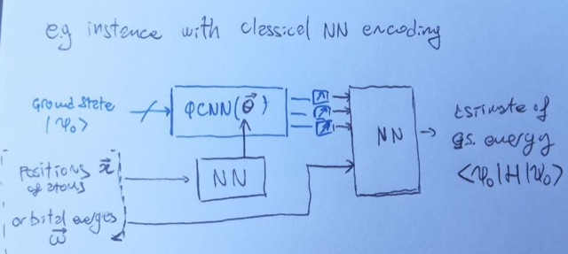

# convoQC
Using quantum convolutional neural networks (QCNN) to predict quantum chemistry properties

## This repository

Contents of the main code folder `convoQC`:
- `notebooks/Guide_to_the_data.ipynb`: guide to generation & usage of data files
- `utils` directory: scripts used for generating/loading data
- `data` directory: all data of generated molecules (in subdirs `molecules` and `json`)

Additionally, at the root level of this repository, we find:
- `figures` directory: figures for use in this README file etc.
- setup code for continuous integration

---

## Generic definition of the problem:

### Goal: 
For a parametrized family of chemical Hamiltonians, use a QML scheme to **learn a *resticted quantum estimator Ô*** of an observable *O*. 
This quantum estimator is a procedure that, given as an input *K* copies of a state *ρ* and some classical information on the system, returns the best estimate of the expectation value Tr[*ρO*].
This restricted estimator should be faithful (i.e. unbiased) on a subset of states (e.g. low energy states, or even only the ground state).
For this reason, the restricted estimator is significantly less demanding than a full observable estimator.

### Definition of the problem to be learned:
**input**: 
- state(s) {ρ} (quantum data)
- structure/parameters of the molecule ω (classical data, size O(N)).

**output**: 
- Expectation value Tr[*ρO*] of some observable O.

### QML model:
The quantum state *ρ* is fed into a PQC whose parameters ***θ*** depend on the classical data *ω* in a functional form ***θ**(ω)* that is is learned.
Local measurements are taken on the output state, and post-processed (either by a fixed procedure or by a parametrised classical function) to yield an estimate of Tr[*ρΟ*].

## Example models

### example 1. without re-encoding
This example uses classical NN to set parameters of the QCNN depending on some classical structure data.
The trained model can be used to estimate ground state energies <*H*>, given as an input a ground state |*ψ*> and some details of the parametrized Hamiltonian.
   

### example 2. with state re-encoding
This example contains more heuristics: the input state is pre-processed by an encoding circuit that implements givens rotations, reconstructing some normalised form of atomic orbitals from the molecular orbitals, and giving a fixed meaning to each qubit.
After this, a trained QCNN and a classical post-processing NN cooperate to construct an estimator of <*H*>.
   

---

## Simple first test case:

As a first test case, we can try to learn an estimator of the ground state energy *E_GS*, given the ground state |*GS*> and some information on the molecule, for a fixed moelcule family (H4).

### Instance system
A molecule in the H4 family, with the following restrictions on the geometry:
- no pair of atoms farther than 0.4 Angstrom (avoid exaggerate overlaps)
- no pair of consecutive atoms farther than 1.5 Angstrom (avoid complete dissociation)

**System modelling**:
The space is parametrized by STO-3G atomic orbitals (for each H atom A single spherically-symmetric orbital, i.e. 2 spin-orbitals).
The fermionic states are represented in the canonical orbital basis, and mapped to the qubit register by the Jordan-Wigner transform.

### QML model I/O

**quantum input of our PQC/QCNN**: 
- The ground state of the molecule
    
**classical input of NNs**:
- The geometry of the molecule
- The orbital energies (single-particle energies for each canonical orbital)
- The canonical orbital matrix, which indicates which linear combination of the atomic orbitals (STO-3G basis functions) construct the molecular orbitals

**Model output**:
- Estimate of the ground state energy of the instance molecule, as a function of the number of runs *M* of the trained PQC.

### Goals

- **Minimal**: obtaining a energy estimate better than the Hartree-Fock energy (for any *M*)
- **Good result**: accuracy comparable/better than a VQE estimation (for any *M*)
- **Very good result**: precision scaling comparable to a VQE estimation (precision ~ 1/sqrt(*M*))
- **Best result & usefulness**: Heisenberg scaling of precision ( ~ 1/*M* )

