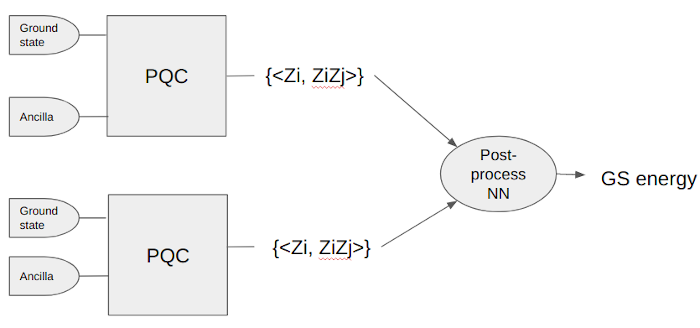

# convoQC
Using quantum convolutional neural networks (QCNN) to predict quantum chemistry properties

## This repository

Contents of the main code folder `convoQC`:
- `notebooks/Guide_to_the_data.ipynb`: guide to generation & usage of data files
- `utils` directory: scripts used for generating/loading data
- `data` directory: all data of generated molecules (in subdirs `molecules` and `json`)

Additionally, at the root level of this repository, we find:
- `figures` directory: figures for use in this README file etc.
- setup code for continuous integration

---

## Generic definition of the problem:

### Goal: 
For a family of chemical Hamiltonians (i.e., molecules), use a QML model to **predict some property of the molecules**. 
The QML model takes as an input *K* copies of a quantum state *ρ* (encoding some properties of the molecule) and some classical information on the molecule, and outputs the best estimate of property to predict.

### Definition of the problem to be learned:
**Input**: 
- quantum state(s) {ρ} (quantum data encoding the molecule)
- structure/parameters of the molecule ω (classical data, size O(N)).

**Output**: 
- Estimate of the property to predict.

### QML model:
The quantum state *ρ* is fed into a PQC whose parameters are obtained by preprocessing the classical data via a neural network.
Local measurements are taken on the output state, and post-processed by a neural network to yield an estimate of the property we wish to predict.

## Serial and Parallel PQCs.

The PQC can reupload different copies of the groundstate both serial or in parallel:

---

## Simple first test case:

As a first test case, we try to predict the ground state energy *E_GS*, given *K* copies of the ground state |*GS*> and some information on the molecule, for the moelcule family H4.

### Instance system
A molecule in the H4 family, with the following restrictions on the geometry:
- no pair of atoms farther than 0.4 Angstrom (avoid exaggerate overlaps)
- no pair of consecutive atoms farther than 1.5 Angstrom (avoid complete dissociation)

**System modelling**:
The space is parametrized by STO-3G atomic orbitals (for each H atom A single spherically-symmetric orbital, i.e. 2 spin-orbitals).
The fermionic states are represented in the canonical orbital basis, and mapped to the qubit register by the Jordan-Wigner transform.

### QML model I/O

**quantum input of our PQC**: 
- The ground state of the molecule
    
**classical input of NNs**:
- The geometry of the molecule
- The orbital energies (single-particle energies for each canonical orbital)
- The canonical orbital matrix, which indicates which linear combination of the atomic orbitals (STO-3G basis functions) construct the molecular orbitals

**Model output**:
- Estimate of the ground state energy of the instance molecule.

### Goals

- **Minimal**: obtaining a energy estimate better than the Hartree-Fock energy.
- **Good result**: accuracy comparable/better than a VQE estimation.

